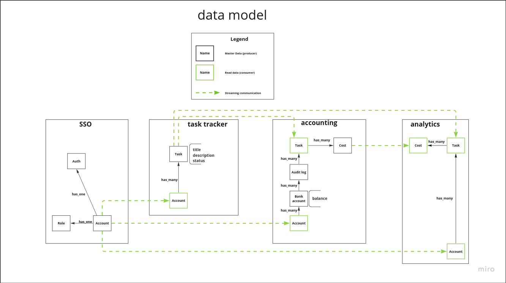

# Awesome Task Exchange System (aTES) app

Code example for ["Асинхронная архитектура"](http://education.borshev.com/architecture) course

## Model of the system


## Data model


## Routes

```
auth rails
localhost:3000 - main
localhost:3000/oauth/applications - oauth app managment

task-tracker service
localhost:2300 - main
localhost:2300/auth/login - oauth login

accounting service
localhost:2400 - main
localhost:2400/auth/login - oauth login
```

